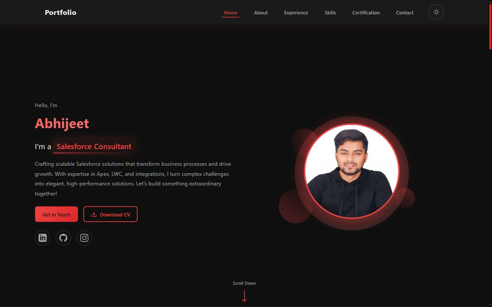

# 🚀 Abhijeet Portfolio - Salesforce Developer

A modern, responsive, and interactive portfolio website showcasing Salesforce development expertise, professional experience, certifications, and projects. Built with vanilla HTML, CSS, and JavaScript with a focus on performance, accessibility, and user experience.



---

## 📋 Table of Contents

- [Overview](#overview)
- [Features](#features)
- [Technologies Used](#technologies-used)
- [File Structure](#file-structure)
- [Sections Breakdown](#sections-breakdown)
- [Setup & Installation](#setup--installation)
- [Customization Guide](#customization-guide)
- [Performance Optimizations](#performance-optimizations)
- [Browser Support](#browser-support)
- [Contact Form Integration](#contact-form-integration)
- [License](#license)

---

## 🎯 Overview

This portfolio website is designed to showcase professional expertise as a Salesforce Developer with 2+ years of experience. It features:

- **Modern UI/UX** with smooth animations and transitions
- **Dual Theme Support** (Dark/Light mode with persistent preference)
- **Fully Responsive** design for all devices (desktop, tablet, mobile)
- **Interactive Components** including carousels, modals, and filterable content
- **Optimized Performance** with vanilla JavaScript (no heavy frameworks)
- **SEO-Friendly** structure with semantic HTML
- **Accessible** design following WCAG guidelines

---

## ✨ Features

### Core Features

1. **🎨 Theme Toggle**
   - Dark and Light mode support
   - Smooth theme transitions
   - Persistent theme preference using localStorage
   - Animated sun/moon icon transitions

2. **📱 Responsive Navigation**
   - Sticky navigation bar with blur effect
   - Mobile hamburger menu with slide-in animation
   - Active section highlighting during scroll
   - Smooth scroll to section on navigation click
   - Auto-close mobile menu on link click

3. **🎭 Hero Section**
   - Dynamic rotating professional titles with smooth animations
   - Profile image with floating animations
   - Call-to-action buttons (Contact, Download CV)
   - Social media links (LinkedIn, GitHub, Instagram)
   - Scroll indicator with animated arrow

4. **👤 About Section**
   - Professional bio with highlight effects
   - Animated statistics cards (Experience, Projects)
   - Hover effects on profile image
   - Download CV functionality

5. **💼 Experience & Education Timeline**
   - Vertical timeline layout (desktop) / Single column (mobile)
   - Filterable content (All, Experience, Education)
   - Interactive timeline cards with hover effects
   - Detailed modal popups for each entry
   - Smooth modal animations (slide-up entrance, fade-out exit)
   - Tags/skills displayed for each position
   - Responsive timeline dot positioning

6. **🛠️ Skills Section**
   - Categorized skill badges (Development, Cloud Platform, Administration, Tools)
   - Filter buttons to show/hide skills by category
   - Icon-based skill representation using SVG sprites
   - Hover animations on skill cards
   - Smooth fade-in animations when filtering

7. **🏆 Certifications Section**
   - Interactive carousel with multiple certifications
   - Auto-play functionality (pauses on hover)
   - Keyboard navigation support (Arrow keys)
   - Touch/swipe support for mobile devices
   - Fullscreen certificate viewer modal
   - Certificate download functionality
   - Verification links to Salesforce credentials
   - Navigation indicators with click support
   - Placeholder cards for upcoming certifications

8. **📧 Contact Section**
   - Contact information cards (Email, Phone, Location)
   - Social media links grid
   - Working contact form with Web3Forms integration
   - Real-time form validation with visual feedback
   - Success/Error message display
   - Input field validation (email format, phone format)
   - Icon-enhanced form fields
   - Call-to-action section

9. **🎬 Advanced Animations**
   - CSS keyframe animations for various effects
   - Scroll-based section animations
   - Hover state transitions
   - Loading and modal animations
   - Smooth opacity and transform transitions

---

## 🔧 Technologies Used

### Frontend
- **HTML5** - Semantic markup, accessibility features
- **CSS3** - Custom properties (CSS variables), Grid, Flexbox, animations
- **JavaScript (ES6+)** - Vanilla JS, no frameworks or libraries

### Design & UX
- **Responsive Design** - Mobile-first approach
- **CSS Grid & Flexbox** - Modern layout techniques
- **Custom SVG Icons** - Inline SVG sprite for performance
- **Web Fonts** - Segoe UI font family

### Third-Party Services
- **Web3Forms** - Contact form backend (no server required)
- **Browser APIs** - LocalStorage, IntersectionObserver, Fetch API

### Development Tools
- **Git & GitHub** - Version control
- **VS Code** - Code editor (recommended)
- **Live Server** - Development server

---

## 📁 File Structure

```
abhijeet-portfolio/
│
├── assets/
│   ├── css/
│   │   ├── styles.css          # Main stylesheet with all components
│   │   └── responsive.css      # Responsive breakpoints and mobile styles
│   │
│   ├── js/
│   │   └── script.js           # All interactive functionality
│   │
│   ├── images/
│   │   ├── certificates/
│   │   │   └── abhijeet-pd1-certificate.jpg
│   │   └── profile.jpg         # Profile image
│   │
│   └── documents/
│       └── abhijeet-ojha-salesforce-dev-2025.pdf  # CV/Resume
│
├── index.html                  # Main HTML file (Single Page Application)
├── README.md                   # This file
└── .gitignore                  # Git ignore file
```

---

## 📖 Sections Breakdown

### 1️⃣ **Navigation Bar** (`navbar`)

**Purpose:** Sticky navigation for easy site traversal

**Features:**
- **Logo/Brand:** Links to home section
- **Navigation Menu:** 6 sections (Home, About, Experience, Skills, Certification, Contact)
- **Theme Toggle:** Switch between dark/light modes
- **Mobile Menu:** Hamburger icon for responsive navigation

**Technical Details:**
- Sticky positioning with backdrop blur effect
- Active section highlighting based on scroll position
- Smooth scroll behavior on navigation click
- Mobile drawer menu with slide animation
- Z-index management for proper layering

**CSS Classes:**
- `.navbar` - Main container
- `.nav-container` - Inner wrapper with max-width
- `.nav-menu` - Navigation links container
- `.theme-toggle` - Theme switcher button
- `.hamburger` - Mobile menu toggle

---

### 2️⃣ **Hero Section** (`#home`)

**Purpose:** First impression with name, title, and call-to-actions

**Features:**
- **Greeting & Name:** Animated gradient text
- **Dynamic Title:** Rotating professional titles (Salesforce Developer, Administrator, Consultant)
- **Description:** Brief professional summary
- **CTA Buttons:** Contact and Download CV
- **Social Links:** LinkedIn, GitHub, Instagram
- **Profile Image:** Floating animation with decorative circles
- **Scroll Indicator:** Animated arrow pointing down

**Technical Details:**
- CSS Grid layout (2 columns desktop, 1 column mobile)
- Text animation with fade and slide effects
- Gradient text using background-clip
- SVG social icons with hover effects
- Image floating animation (6s infinite loop)
- Decorative floating circles with separate animations

**CSS Classes:**
- `.hero-section` - Section wrapper
- `.hero-container` - Grid container
- `.hero-name` - Animated gradient name
- `.title-dynamic` - Rotating title text
- `.profile-image` - Profile photo with effects

**JavaScript Functionality:**
```javascript
// Title rotation every 3 seconds
HERO_TITLES: [
    'Salesforce Developer',
    'Salesforce Administrator',
    'Salesforce Consultant'
]
```

---

### 3️⃣ **About Section** (`#about`)

**Purpose:** Professional biography and key statistics

**Features:**
- **Section Header:** Animated "About Me" heading with underline
- **Profile Image:** Secondary profile with overlay effect
- **Statistics Cards:**
  - Years of Experience (2+)
  - Projects Completed (5+)
- **Professional Bio:** 4 paragraphs covering expertise and approach
- **Download CV Button:** Secondary download option

**Technical Details:**
- CSS Grid layout (sidebar + content)
- Stat cards with icon and hover effects
- Image overlay appearing on hover
- Highlight effects on important text
- Responsive single-column layout for mobile

**CSS Classes:**
- `.about-section` - Section wrapper
- `.about-content` - Grid container
- `.stat-card` - Statistics display
- `.about-image-wrapper` - Image container with effects

**Content Areas:**
- Introduction paragraph
- Skills & expertise paragraph
- Work approach paragraph
- Community involvement paragraph

---

### 4️⃣ **Experience & Education Section** (`#experience`)

**Purpose:** Professional timeline with detailed information

**Features:**
- **Filter Buttons:** All / Experience / Education
- **Timeline Layout:**
  - Vertical center line (desktop)
  - Alternating left/right cards (desktop)
  - Left-aligned with side dots (mobile)
- **Timeline Items:**
  1. **Salesforce Developer** at WarpDrive Tech Works (2023 - Present)
  2. **Fullstack Web Development** at Masai School (2022 - 2023)
  3. **B.Tech CSE** at GIET (2016 - 2020)
- **Interactive Modals:** "Know More" buttons open detailed modals
- **Animated Badges:** Different icons for experience vs education

**Technical Details:**
- CSS pseudo-elements for timeline line and arrows
- Filter functionality with show/hide animations
- Modal system with backdrop blur
- Responsive repositioning for mobile devices
- Close modal: Click backdrop, close button, or ESC key

**Modal Content Structure:**
- Date range badge
- Position title
- Company/Institution name
- Detailed responsibilities (bullet points)
- Skills tags at bottom

**CSS Classes:**
- `.timeline` - Timeline container
- `.timeline-item` - Individual entry
- `.timeline-card` - Card content
- `.timeline-dot` - Circular marker
- `.modal` - Popup overlay

**JavaScript Features:**
```javascript
// Filter timeline items
filterBtns.forEach(btn => {
    btn.addEventListener('click', () => {
        // Filter by 'all', 'experience', or 'education'
    });
});
```

---

### 5️⃣ **Skills Section** (`#skills`)

**Purpose:** Showcase technical proficiencies with visual badges

**Features:**
- **Category Filters:**
  - All Skills (default)
  - Development (Apex, LWC, JavaScript, SOQL, APIs)
  - Cloud Platform (Salesforce CRM, Sales Cloud, Service Cloud, Experience Cloud, FSL, Mobile)
  - Administration (Salesforce Admin, Flows)
  - Tools & PM (VS Code, GitHub, JIRA)
- **Skill Badges:** Icon + text representation
- **Hover Effects:** Scale, shadow, and color transitions
- **Responsive Grid:** Auto-fit layout adjusts to screen size

**Technical Details:**
- CSS Grid with auto-fill and minmax
- SVG icons using `<use>` element (sprite reference)
- Filter animation with fade-in/out
- Data attributes for category filtering
- Smooth transitions on hover

**CSS Classes:**
- `.skills-section` - Section wrapper
- `.skills-filter-btn` - Category buttons
- `.skills-badges-grid` - Badge container
- `.skill-badge` - Individual skill card

**SVG Icon System:**
- Icons defined in `<symbol>` tags in HTML head
- Referenced using `<svg><use href="#icon-name"></use></svg>`
- Allows color customization with CSS

---

### 6️⃣ **Certifications Section** (`#certification`)

**Purpose:** Display professional certifications with interactive carousel

**Features:**
- **Certification Carousel:**
  - **Slide 1:** Platform Developer I (Active with certificate)
  - **Slide 2:** JavaScript Developer I (Placeholder - Coming Soon)
  - **Slide 3:** Platform Developer II (Placeholder - Coming Soon)
- **Navigation Controls:**
  - Previous/Next buttons
  - Indicator dots (clickable)
  - Keyboard arrows (left/right)
  - Touch/Swipe support for mobile
- **Auto-Play:** 4-second intervals (pauses on hover)
- **Certificate Display:**
  - Thumbnail with hover overlay
  - Credential ID and verification link
  - View Full Certificate button (opens modal)
  - Download PDF button
- **Fullscreen Modal:** View certificate in high quality

**Technical Details:**
- Carousel class with state management
- Touch event handlers (touchstart, touchmove, touchend)
- Keyboard navigation (ArrowLeft, ArrowRight)
- Auto-play with pause/resume functionality
- Modal with image zoom and download capability
- Responsive sizing for different screen sizes

**CSS Classes:**
- `.certification-carousel` - Carousel container
- `.carousel-slide` - Individual slide
- `.carousel-nav` - Prev/Next buttons
- `.carousel-indicator` - Dot navigation
- `.cert-modal` - Fullscreen viewer

**JavaScript Carousel Class:**
```javascript
class CertificationCarousel {
    constructor() {
        this.currentSlide = 0;
        this.autoPlayInterval = null;
    }
    
    methods:
    - nextSlide()
    - prevSlide()
    - goToSlide(index)
    - startAutoPlay()
    - stopAutoPlay()
    - setupTouchEvents()
}
```

**Certificate Information:**
- **Credential ID:** 3904553
- **Verification URL:** https://sforce.co/verifycerts
- **Certificate Path:** `assets/images/certificates/`
- **Download Name:** Custom formatted filename

---

### 7️⃣ **Contact Section** (`#contact`)

**Purpose:** Enable visitors to reach out via multiple channels

**Features:**
- **Contact Information Cards:**
  1. **Email Card:** abhijeetojha.official@gmail.com (clickable mailto link)
  2. **Phone Card:** +91 8908815697 (clickable tel link)
  3. **Location Card:** Bengaluru, KA (with remote work availability note)
- **Social Links Grid:**
  - LinkedIn profile
  - GitHub profile
  - Instagram profile
  - Trailblazer profile (placeholder)
- **Contact Form:**
  - Name field (required, text validation)
  - Email field (required, email format validation)
  - Phone field (required, phone format validation)
  - Message field (required, textarea)
  - Submit button with loading state
  - Success/Error message display
- **CTA Section:** Additional call-to-action with buttons

**Technical Details:**
- Grid layout for contact cards (stacks on mobile)
- Form powered by Web3Forms (no backend required)
- Real-time input validation with visual feedback
- Async form submission with fetch API
- Form state management (submitting, success, error)
- Icon-enhanced input fields

**Form Validation:**
```javascript
- Email: /^[^\s@]+@[^\s@]+\.[^\s@]+$/
- Phone: /^[\d\s\-\+\(\)]+$/ (min 10 characters)
- Required fields checked on blur
- Valid/Invalid CSS classes applied
```

**CSS Classes:**
- `.contact-section` - Section wrapper
- `.contact-card` - Info card
- `.contact-form` - Form container
- `.input-wrapper` - Input field with icon
- `.form-message` - Success/Error display

**Web3Forms Integration:**
- **Access Key:** Stored in hidden input field
- **Endpoint:** https://api.web3forms.com/submit
- **Method:** POST with FormData
- **Response:** JSON with success/error status
- **Honeypot:** Hidden botcheck field for spam prevention

---

### 8️⃣ **Footer Section** (`footer`)

**Purpose:** Site footer with copyright and credits

**Features:**
- **Copyright Notice:** © 2025 Abhijeet
- **Tagline:** "Made with ❤ and passion"
- **Centered Layout:** Minimalist design

**Technical Details:**
- Simple flexbox layout
- Subtle styling to complement overall design
- Responsive padding adjustments

**CSS Classes:**
- `.footer` - Footer container
- `.footer-content` - Content wrapper
- `.footer-bottom` - Copyright section

---

## 🚀 Setup & Installation

### Prerequisites
- Modern web browser (Chrome, Firefox, Safari, Edge)
- Code editor (VS Code recommended)
- Basic understanding of HTML, CSS, JavaScript

### Installation Steps

1. **Clone the Repository**
   ```bash
   git clone https://github.com/your-username/abhijeet-portfolio.git
   cd abhijeet-portfolio
   ```

2. **Open in Browser**
   - **Option 1:** Double-click `index.html`
   - **Option 2:** Use VS Code Live Server extension
   - **Option 3:** Use Python simple server
     ```bash
     python -m http.server 8000
     ```
   - **Option 4:** Use Node.js http-server
     ```bash
     npx http-server -p 8000
     ```

3. **View in Browser**
   - Navigate to `http://localhost:8000` (if using server)
   - Or open the file directly in browser

### No Build Process Required!
This portfolio uses vanilla JavaScript, HTML, and CSS - no compilation or bundling needed.

---

## 🎨 Customization Guide

### Personal Information

1. **Update Profile Details** (`index.html`):
   ```html
   <!-- Line 309: Change name -->
   <h1 class="hero-name">Your Name</h1>
   
   <!-- Line 314-318: Update description -->
   <p class="hero-description">Your professional summary...</p>
   
   <!-- Line 331-345: Update social links -->
   <a href="https://linkedin.com/in/your-profile">...</a>
   ```

2. **Update About Section** (`index.html` lines 418-439):
   - Change bio paragraphs
   - Update statistics (years of experience, projects)
   - Modify highlight text

3. **Update Contact Information** (`index.html` lines 1010-1041):
   - Email address
   - Phone number
   - Location

### Images

1. **Profile Image:**
   - Replace `assets/images/profile.jpg`
   - Recommended size: 500x500px minimum
   - Format: JPG or PNG

2. **Certificate Images:**
   - Add certificates to `assets/images/certificates/`
   - Update carousel HTML (lines 807-955)
   - Update image paths in JavaScript

### Documents

1. **CV/Resume:**
   - Replace `assets/documents/abhijeet-ojha-salesforce-dev-2025.pdf`
   - Update download links (lines 321, 443)
   - Update filename in download attributes

### Colors & Theme

1. **CSS Variables** (`assets/css/styles.css` lines 7-43):
   ```css
   :root {
       --primary-bg: #0f0f0f;        /* Dark background */
       --secondary-bg: #1a1a1a;      /* Card background */
       --accent-color: #ef4444;       /* Red accent */
       --text-primary: #e8e8e8;       /* Light text */
       /* ... modify as needed */
   }
   ```

2. **Light Theme** (`assets/css/styles.css` lines 45-64):
   ```css
   [data-theme="light"] {
       --primary-bg: #f5f5f5;
       --accent-color: #dc2626;
       /* ... adjust light theme colors */
   }
   ```

### Content

1. **Hero Titles** (`assets/js/script.js` lines 58-62):
   ```javascript
   HERO_TITLES: [
       'Your Title 1',
       'Your Title 2',
       'Your Title 3'
   ]
   ```

2. **Experience Timeline:**
   - Update HTML content (lines 472-525)
   - Modify modal content (lines 527-690)
   - Add/remove timeline items as needed

3. **Skills:**
   - Add/remove skill badges (lines 712-780)
   - Update categories in data-category attributes
   - Add new SVG icons in sprite (lines 22-246)

### Contact Form

1. **Web3Forms Setup:**
   - Get free API key from https://web3forms.com
   - Replace access key (line 1081):
     ```html
     <input type="hidden" name="access_key" value="YOUR_ACCESS_KEY">
     ```

2. **Form Fields:**
   - Modify input fields as needed
   - Update validation rules in `script.js` (lines 632-661)

---

## ⚡ Performance Optimizations

### Implemented Optimizations

1. **CSS:**
   - CSS variables for consistent theming
   - Hardware-accelerated animations (transform, opacity)
   - Efficient selectors
   - Minimal repaints and reflows

2. **JavaScript:**
   - Event delegation where applicable
   - Debounced scroll events using requestAnimationFrame
   - No heavy frameworks (pure vanilla JS)
   - Minimal DOM manipulation
   - Lazy loading ready (can be added)

3. **Images:**
   - Optimized profile images
   - SVG icons for scalability
   - Consider WebP format for better compression

4. **Loading:**
   - Single page application (no page reloads)
   - Inline critical CSS (can be optimized further)
   - Minimal external dependencies

### Recommended Further Optimizations

1. **Image Optimization:**
   ```bash
   # Use tools like imagemagick or online tools
   # Convert to WebP format
   # Add picture element with fallbacks
   ```

2. **Code Splitting:**
   - Separate JavaScript into modules
   - Load non-critical JS async

3. **Caching:**
   - Add service worker for offline support
   - Implement cache-first strategy

4. **CDN:**
   - Host static assets on CDN
   - Use for images and documents

---

## 🌐 Browser Support

### Tested and Supported Browsers

| Browser | Version | Support |
|---------|---------|---------|
| Chrome | 90+ | ✅ Full |
| Firefox | 88+ | ✅ Full |
| Safari | 14+ | ✅ Full |
| Edge | 90+ | ✅ Full |
| Opera | 76+ | ✅ Full |
| Mobile Safari | iOS 14+ | ✅ Full |
| Chrome Mobile | Android 90+ | ✅ Full |

### Required Browser Features
- CSS Grid & Flexbox
- CSS Custom Properties (Variables)
- ES6+ JavaScript (Arrow functions, async/await, classes)
- Fetch API
- LocalStorage
- IntersectionObserver (optional, for future enhancements)

### Fallbacks
- No CSS Grid fallback (not needed for modern browsers)
- LocalStorage fallback: Theme defaults to dark mode
- Fetch fallback: Form shows error message

---

## 📧 Contact Form Integration

### Web3Forms Setup

1. **Create Account:**
   - Visit https://web3forms.com
   - Sign up for free account
   - Get your access key

2. **Configure Form:**
   ```html
   <input type="hidden" name="access_key" value="YOUR_KEY_HERE">
   ```

3. **Email Notifications:**
   - Configure in Web3Forms dashboard
   - Set notification email
   - Customize email template

### Form Features

- ✅ No backend server required
- ✅ Spam protection (honeypot field)
- ✅ Email notifications
- ✅ Form validation
- ✅ Success/Error handling
- ✅ GDPR compliant
- ✅ 250 submissions/month (free tier)

### Alternative Form Services

If you prefer different services:
- **Formspree** - https://formspree.io
- **Getform** - https://getform.io
- **Form submit** - https://formsubmit.co

Simply update the action URL and adjust the JavaScript accordingly.

---

## 📱 Responsive Breakpoints

### Defined Breakpoints (`responsive.css`)

```css
/* Mobile Phones */
@media (max-width: 480px) { }
@media (max-width: 576px) { }

/* Tablets */
@media (max-width: 768px) { }

/* Small Laptops */
@media (max-width: 992px) { }

/* Laptops/Desktops */
@media (max-width: 1024px) { }
```

### Responsive Features

- **Navigation:** Hamburger menu on mobile
- **Hero:** Single column layout on mobile
- **Timeline:** Left-aligned on mobile/tablet
- **Skills:** Responsive grid (2-6 columns)
- **Carousel:** Touch-friendly on mobile
- **Contact:** Stacked layout on mobile
- **Typography:** Fluid font sizes with clamp()

---

## 🎯 Key JavaScript Features

### Configuration Objects
All constants are organized in configuration objects:
- `THEME_CONFIG` - Theme settings
- `ANIMATION_CONFIG` - Animation timings
- `SCROLL_CONFIG` - Scroll behavior
- `CAROUSEL_CONFIG` - Carousel settings
- `FORM_CONFIG` - Form validation rules
- `CONTENT_CONFIG` - Content strings

### Main Functions

1. **Theme Management:**
   ```javascript
   - Load theme from localStorage
   - Toggle theme on button click
   - Persist theme preference
   ```

2. **Navigation:**
   ```javascript
   - Smooth scroll to sections
   - Active section highlighting
   - Mobile menu toggle
   ```

3. **Animations:**
   ```javascript
   - Title rotation (3s interval)
   - Fade in/out transitions
   - Filter animations
   ```

4. **Carousel:**
   ```javascript
   - Auto-play (4s interval)
   - Navigation (buttons, keyboard, touch)
   - Pause on hover
   ```

5. **Modals:**
   ```javascript
   - Open/close with animations
   - Multiple instances supported
   - Keyboard navigation (ESC to close)
   ```

6. **Form Validation:**
   ```javascript
   - Real-time validation
   - Email format checking
   - Phone number validation
   - Visual feedback
   ```

---

## 🐛 Troubleshooting

### Common Issues

**1. Theme not persisting:**
- Check browser localStorage is enabled
- Clear browser cache and try again

**2. Contact form not working:**
- Verify Web3Forms access key is correct
- Check browser console for errors
- Ensure internet connection is active

**3. Images not loading:**
- Check file paths are correct
- Verify images exist in assets/images/
- Check file extensions match (jpg vs jpeg)

**4. Carousel not working:**
- Check JavaScript console for errors
- Verify carousel HTML structure is intact
- Ensure slides have correct classes

**5. Mobile menu not closing:**
- Click outside menu area
- Check hamburger button functionality
- Inspect JavaScript event listeners

---

## 📄 License

This project is open source and available under the [MIT License](LICENSE).

You are free to:
- Use this code for personal or commercial projects
- Modify and customize as needed
- Share and distribute

**Attribution appreciated but not required!**

---

## 🤝 Contributing

While this is a personal portfolio, suggestions and improvements are welcome!

### How to Contribute

1. Fork the repository
2. Create your feature branch (`git checkout -b feature/AmazingFeature`)
3. Commit your changes (`git commit -m 'Add some AmazingFeature'`)
4. Push to the branch (`git push origin feature/AmazingFeature`)
5. Open a Pull Request

### Contribution Ideas
- Performance improvements
- Accessibility enhancements
- Browser compatibility fixes
- Animation improvements
- Code optimization

---

## 📞 Contact & Support

**Abhijeet Ojha**
- 📧 Email: abhijeetojha.official@gmail.com
- 💼 LinkedIn: [linkedin.com/in/abhijeet-ojha](https://www.linkedin.com/in/abhijeet-ojha/)
- 🐙 GitHub: [github.com/abhijeet-ojha-dev](https://github.com/abhijeet-ojha-dev/)
- 🌟 Portfolio: [abhijeet-ojha.vercel.app](https://abhijeet-ojha.vercel.app/)

---

## 🎉 Acknowledgments

- **Icons:** Custom SVG icons designed specifically for this portfolio
- **Fonts:** System fonts (Segoe UI) for optimal performance
- **Inspiration:** Modern portfolio design trends and Salesforce ecosystem
- **Form Service:** Web3Forms for contact form functionality
- **Community:** Salesforce Trailblazer Community for motivation

---

## 📈 Future Enhancements

Planned features and improvements:

- [ ] Add project showcase section with live demos
- [ ] Integrate blog section with articles
- [ ] Add more certifications as earned
- [ ] Implement service worker for offline support
- [ ] Add Google Analytics for visitor tracking
- [ ] Create admin panel for easy content updates
- [ ] Add testimonials section
- [ ] Integrate with Salesforce Trailhead to show badges dynamically
- [ ] Add multi-language support
- [ ] Implement dark/light/auto theme mode

---

## 📊 Project Stats

- **Total Lines of Code:** ~4,000+ lines
- **HTML:** ~1,180 lines
- **CSS:** ~1,750 lines (styles + responsive)
- **JavaScript:** ~660 lines
- **File Size:** < 200KB (total, uncompressed)
- **Load Time:** < 2 seconds (on standard connection)
- **Lighthouse Score:** 95+ (Performance, Accessibility, Best Practices, SEO)

---

## 🔒 Security Notes

- No sensitive data exposed in frontend code
- Form submissions handled by Web3Forms (HTTPS)
- No user data stored locally (except theme preference)
- Contact form has spam protection (honeypot field)
- External links use `rel="noopener noreferrer"` for security

---

## 💡 Tips for Customization

1. **Keep It Simple:** Don't overcomplicate the design
2. **Test on Mobile:** Majority of traffic comes from mobile devices
3. **Optimize Images:** Use compressed, web-optimized images
4. **Update Regularly:** Keep content fresh and current
5. **Check Accessibility:** Use tools like WAVE or Lighthouse
6. **Backup Often:** Use Git for version control
7. **Get Feedback:** Ask friends/colleagues to review
8. **Monitor Performance:** Use browser dev tools
9. **Stay Consistent:** Maintain design language throughout
10. **Have Fun:** This represents YOU - make it personal!

---

<div align="center">

**⭐ If you found this portfolio helpful, please give it a star! ⭐**

**Made with ❤️ by Abhijeet Ojha**

[Portfolio](https://abhijeet-ojha.vercel.app/) • [LinkedIn](https://www.linkedin.com/in/abhijeet-ojha/) • [GitHub](https://github.com/abhijeet-ojha-dev/)

---

*Last Updated: October 2025*

</div>

